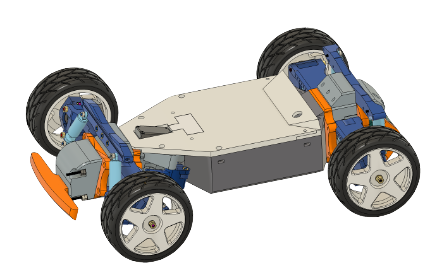

# CrazyDonkeyTarmo

`TBD`:
`Currently being organized, please be patient.!!! `
`项目资料还在更新中，目前已经开放 RC 车制作部分!!!`

`CrazyDonkeyTarmo` 项目目标是保留高性能RC车乐趣的同时能开展学习自动驾驶技术。  
项目深度改造 Tarmo5 RC 车， 结合 DonkeyCar 自动驾驶项目。

----
## 车辆硬件制作
* CDT_Assemble.pdf ： 组装说明 (P1-车辆)
* STL： 3D 打印文件 （打印参数见Readme)

## PCB电路 （Optinal)
* PCB_CrazyPowerBoard： 探路者控制板 
* PCB_CrazyDonkeyTarmoBoard：超级电源板 
    * BOM.csv: 采购元件清单
    * ibom.html：元件摆放(细节见PNG图片)
    * Gerber：PCB生产
    * Schematic：原理图
    
    

## 自动驾驶篇 (Todo)
Todo

## Reference
* [tarmo5](https://www.reddit.com/r/EngineeringNS/comments/zvellk/tarmo5/)
* [donkeycar](https://www.donkeycar.com/)
  

## License

 This work is licensed under a <a rel="license" href="http://creativecommons.org/licenses/by-nc-nd/4.0/">Creative Commons Attribution-NonCommercial-NoDerivatives 4.0 International License</a>.

Copyright © 2024, 疯狂豆® 