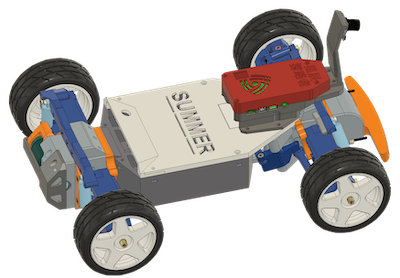

# CrazyDonkeyTarmo

The `CrazyDonkeyTarmo` project is all about keeping the thrill of high-performance RC cars while diving into autonomous driving tech.
We're giving the Tarmo5 RC car a serious makeover and blending it with the DonkeyCar self-driving project.

## Video Introduction
* [Building the Car](https://www.bilibili.com/video/BV1qM4m1U7vm)
* [Autonomous Driving](https://www.bilibili.com/video/BV124HyeUER8)

---
## Vehicle Assembly (Hardwear_Car)
* [CDT_Assemble.pdf](./Hardwear_Car/CDT_Assemble.pdf): Assembly Manual
* STL: 3D printing files (Printing parameters can be found in `stl/README.md`)
* [Parts.md](./Hardwear_Car/Parts.md): Some parts used in the video

## PCB Circuit (Optional)
* PCB_CrazyDonkeyTarmoBoard: Super Power Board
* PCB_CrazyPowerBoard: Pathfinder Control Board
    * BOM.csv: Component procurement list
    * ibom.html: Component placement (details in PNG images)
    * Gerber: PCB manufacturing
    * Schematic: Circuit diagrams
* Circuit Connection: [Wiring Diagram.jpg](./Hardwear_Car/wiring_diagram.jpg)

---
## Autonomous Driving (Softwear_SelfDrive)
* [Star Pathfinder Autonomous Driving System Manual](./Softwear_SelfDrive/README.md)
* [Extended Part - Object Recognition](./Softwear_SelfDrive/crazydonekytarmo_od.md) (Optional)
* myconfig: Pathfinder configuration reference file

## Reference
* [tarmo5](https://www.reddit.com/r/EngineeringNS/comments/zvellk/tarmo5/)
* [donkeycar](https://www.donkeycar.com/)

## License

 This work is licensed under a <a rel="license" href="http://creativecommons.org/licenses/by-nc-nd/4.0/">Creative Commons Attribution-NonCommercial-NoDerivatives 4.0 International License</a>.

Copyright © 2024, 疯狂豆®
